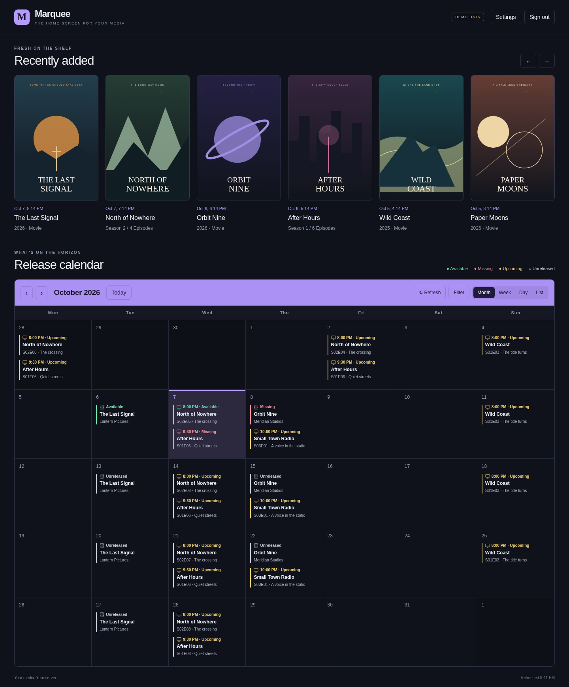

# Marquee

 

A small self-hosted media home screen: recently added at the top, a release calendar underneath. Sign in with your Jellyfin account. Your recent titles follow your Jellyfin library permissions.



<details>
<summary>Mobile demo</summary>
<p align="center"></p>
</details>

## Beta

This is a local beta. No application image or public release has been published yet. The compose setup below runs the source using the official Node image, without a Dockerfile. Live-server compatibility and container deployment still need testing before a release.

## Contents

- [Features](#features)
- [Run with Docker Compose](#run-with-docker-compose)
- [Connection settings](#connection-settings)
- [Privacy and permissions](#privacy-and-permissions)
- [Development and tests](#development-and-tests)

## Features

- Seerr access matches the signed-in Jellyfin ID to an imported Seerr user. Movie/TV permissions and quotas come from Seerr. No allowlist. Requests use the server API key with the verified user ID override; TV requests include all requestable seasons. Ask a Seerr admin to import your Jellyfin user if no match exists. Names and email addresses are never used for matching.

- Jellyfin username and password login gates all media APIs.
- Horizontal poster shelf with added date/time, title, and TV season episode counts.
- Sonarr TV episodes and Radarr movie releases in month, week, day, agenda (next 14 days), or list views. The app remembers the last view used on each device.
- Monday-first calendar, today highlight, previous/next period, refresh, and type/status filters. An optional hide-unmonitored filter drops unmonitored Sonarr/Radarr entries. Movies can appear twice: cinema and digital/physical releases are separate entries.
- Green: available file. Red: release has passed but the file is missing. Yellow: upcoming TV. Gray: unreleased movie.
- Optional current weather and three-day forecast, off by default. Choose a city and Fahrenheit/Celsius in Settings, per viewer and device. Open-Meteo weather and city search are free for non-commercial use, with no API key or account.
- Jellyfin administrators can change the shared display name in Settings. It defaults to Marquee and survives container restarts.
- A quiet "Your requests" section lists recent request status. No badges, no counts.
- Poster and title taps deep-link into Jellyfin's web player through the external URL setting.
- Settings includes per-service connection tests with real error messages (DNS failure, connection refused, timeout, or HTTP status).
- Installable as a PWA (manifest and service worker). Only static assets are cached; media API responses are never cached.
- Settings can hide either main section, weather, the status legend, added dates, and poster navigation arrows.
- Mobile defaults to a readable list. Month/week remain available with horizontal scrolling instead of squeezed columns.
- Settings are stored per account on the current device. The display name is shared; other display/weather preferences are per viewer/device.
- Demo mode with fictional titles and original sample poster art. No external credentials required.

## Run with Docker Compose

Requires Docker Engine with the Compose plugin. Put this source folder on your server. You do not need to build a Dockerfile.

1. Copy `.env.example` to `.env` beside `compose.yaml`.
2. Fill in your service URLs and keys. Keep `.env` private and out of git.
3. Set your timezone. Keep `DEMO_MODE=false` for real use.
4. Start:

```sh
docker compose up -d
```

Open the configured port through an HTTPS reverse proxy. `COOKIE_SECURE=true` requires HTTPS. For a local HTTP demo only, set `DEMO_MODE=true` and `COOKIE_SECURE=false`.

The initial beta copies the mounted source into a temporary writable container directory and installs the locked production dependencies at startup. This needs internet access to the package registry. Sessions live in memory, so a restart signs users out. The `marquee-settings` volume keeps the administrator-set display name across container restarts. Display and weather preferences remain per account in the browser. Do not delete the settings volume when upgrading.

### Copy-paste compose

```yaml
services:
  marquee:
    image: node:22-alpine
    container_name: marquee
    working_dir: /app
    user: node
    init: true
    command:
      - sh
      - -c
      - cp /source/package*.json /app/ && cp -R /source/src /source/public /app/ && npm ci --omit=dev --ignore-scripts --no-audit --no-fund && node src/server.js
    ports:
      - "${MARQUEE_PORT}:8739"
    environment:
      PORT: "8739"
      TZ: ${TZ}
      DEMO_MODE: ${DEMO_MODE}
      COOKIE_SECURE: ${COOKIE_SECURE}
      JELLYFIN_URL: ${JELLYFIN_URL}
      SONARR_URL: ${SONARR_URL}
      SONARR_API_KEY: ${SONARR_API_KEY}
      RADARR_URL: ${RADARR_URL}
      RADARR_API_KEY: ${RADARR_API_KEY}
      SEERR_URL: ${SEERR_URL}
      SEERR_API_KEY: ${SEERR_API_KEY}
      JELLYFIN_WEB_URL: ${JELLYFIN_WEB_URL}
    volumes:
      - ./:/source:ro
      - marquee-settings:/home/node
    tmpfs:
      - /app:uid=1000,gid=1000,mode=0700
      - /home/node/.npm:uid=1000,gid=1000,mode=0700
    read_only: true
    cap_drop:
      - ALL
    security_opt:
      - no-new-privileges:true
    restart: unless-stopped
    healthcheck:
      test:
        [
          "CMD",
          "node",
          "-e",
          "fetch('http://127.0.0.1:8739/api/config').then(r=>process.exit(r.ok?0:1)).catch(()=>process.exit(1))",
        ]
      interval: 30s
      timeout: 5s
      start_period: 60s

volumes:
  marquee-settings:
```

### Filled `.env` example

These are example values, not working credentials.

```dotenv
# Marquee settings. Copy to .env and fill in your own values. Keep .env private.

# Port on the host that Marquee listens on (container port stays 8739).
MARQUEE_PORT=8739
# Your timezone, for example America/New_York. List: en.wikipedia.org/wiki/List_of_tz_database_time_zones
TZ=Etc/UTC
# Demo mode shows fake titles with no login. For trying the app only - never for a real deployment.
DEMO_MODE=false
# true when Marquee sits behind an HTTPS reverse proxy (recommended). false only for a local HTTP demo.
COOKIE_SECURE=true

# Internal vs external URLs: the container talks to your services over your
# Docker/LAN network (internal). Deep links people tap on their phones use the
# public reverse-proxy address (external). Set both when they differ.

# Jellyfin internal URL: how this container reaches Jellyfin (Docker service name or LAN address).
JELLYFIN_URL=http://jellyfin:8096
# Jellyfin external URL: the address browsers open when you tap a poster. Falls back to JELLYFIN_URL.
JELLYFIN_WEB_URL=https://jellyfin.example.com

# Sonarr: base URL + API key (Settings > General in Sonarr).
SONARR_URL=http://sonarr:8989
SONARR_API_KEY=replace-with-your-sonarr-api-key
# Radarr: base URL + API key (Settings > General in Radarr).
RADARR_URL=http://radarr:7878
RADARR_API_KEY=replace-with-your-radarr-api-key

# Seerr (Jellyseerr or Overseerr): base URL + API key (Settings > General).
SEERR_URL=http://seerr:5055
SEERR_API_KEY=replace-with-your-seerr-api-key

# Optional external URLs for the other services, reserved for future deep links (unused today):
# SONARR_WEB_URL=https://sonarr.example.com
# RADARR_WEB_URL=https://radarr.example.com
# SEERR_WEB_URL=https://seerr.example.com

# Weather is set per viewer in Settings: city picker and F/C units.
# Open-Meteo weather and city search are free for non-commercial use. No API key or account needed.
# Dashboard display name is set by a Jellyfin administrator in Settings (default Marquee).
```

Dockhand users can put these variables in the stack's Environment tab instead of a `.env` file. The source folder must still be mounted: change `./:/source:ro` to your source checkout location if Dockhand's stack directory differs. No particular host OS, NAS, or stack manager is required.

### Reverse proxy

Terminate HTTPS at your preferred reverse proxy and forward to port 8739. Preserve the original Host header for same-origin write checks. Do not cache `/api/` responses. Do not expose the HTTP port directly to the internet. Users should always submit Jellyfin passwords over HTTPS.

## Connection settings

- `JELLYFIN_URL`: server base URL, including a path prefix if configured. No Jellyfin API key. Each user enters their own username/password on the sign-in screen.
- `SONARR_URL` and `SONARR_API_KEY`: server base URL and API key. Requests use `/api/v3/calendar` with `includeSeries=true`.
- `RADARR_URL` and `RADARR_API_KEY`: server base URL and API key. Requests use `/api/v3/calendar`.
- `SEERR_URL` and `SEERR_API_KEY`: Jellyseerr or Overseerr base URL and API key. Search uses `/api/v1/search`; requests use `/api/v1/request`.
- Internal/external URL split: `JELLYFIN_URL`, `SONARR_URL`, `RADARR_URL`, and `SEERR_URL` are how the container reaches each service (Docker network or LAN). `JELLYFIN_WEB_URL` is the public address browsers open when someone taps a poster; it defaults to `JELLYFIN_URL`. Set both when containers use an internal address phones cannot open. `SONARR_WEB_URL`, `RADARR_WEB_URL`, and `SEERR_WEB_URL` are reserved for future deep links and unused today.
- Weather: use Settings to find and pick a city, choose F/C units, and enable the widget. These choices are saved for that viewer on that device, not in `.env`.
- Display name: Jellyfin administrators see a name field in Settings. The default is Marquee; the shared value is stored in the settings volume. This changes the dashboard header and browser tab. Installed PWA icons/name remain Marquee.
- `TZ`: server timezone. Calendar air times and poster dates use the viewer's browser timezone.

The app server must be able to reach all configured services. Browser CORS settings are not needed because requests go through the server.

Movie dates prefer digital release, then physical release, then cinema release. One movie appears once per response. A file always makes an entry Available. TV season counts include the episodes visible to that Jellyfin user in that season, not only the newly added batch. The shelf groups the 18 newest movie/episode records by TV season. Different seasons of a show may appear separately.

## Privacy and permissions

The recent Jellyfin shelf and Seerr request list are per-user. **The Sonarr/Radarr calendar is shared among all signed-in viewers.** Seerr search runs as the linked user and the request list shows only that user's requests. They may include titles a viewer cannot access in Jellyfin. Do not deploy for untrusted users without a calendar permission layer. Seerr requesting follows the linked user's own movie/TV permissions and quotas; the Seerr API key never reaches the browser. Request-list titles come from Seerr's response; if a title is missing there, the row falls back to its TMDB id.

Passwords are sent to Jellyfin and are not stored or logged. Jellyfin access tokens and opaque sessions stay in server memory. Cookies are HttpOnly, SameSite Strict, secure by default, and expire after eight hours. Sign-out removes the local session. It does not revoke the Jellyfin access token upstream; server restarts drop stored tokens.

Media APIs and image proxies require a session. Images are limited to item IDs returned for that viewer. API keys never go to the browser. Service URLs are administrator configuration, not user-editable request destinations. Login is rate-limited per direct client IP; behind a proxy this can limit the whole proxy group together. The app rejects cross-origin writes, escapes media titles, sends security headers, and blocks indexing with a robots rule and headers. These do not replace authentication.

Demo mode must not be enabled for private live deployments: it allows anyone to open the sample dashboard without Jellyfin credentials. Demo adapters are separate from the live adapters and cannot expose live data.

City searches share the typed city name with Open-Meteo when you press Find city. Forecast requests share the selected city coordinates only when the widget is enabled. Results are cached for 15 minutes. Attribution stays visible with the widget. Weather and geocoding need no key or account and are free for non-commercial use. See [geocoding documentation](https://open-meteo.com/en/docs/geocoding-api) and [Open-Meteo documentation](https://open-meteo.com/en/docs) for service terms and use limits.

## Development and tests

Node 22 or newer:

```sh
npm ci
DEMO_MODE=true COOKIE_SECURE=false npm start
```

For tests, install Chromium with Playwright or set `CHROME_PATH` to a local Chrome executable:

```sh
npx playwright install chromium
npm test
```

Tests live in `tests/`. They cover calendar status mapping, date ranges, API auth gates, same-origin protection, no-crawl/security headers, calendar navigation and filters, settings persistence, weather toggling, logout, and mobile overflow at 393, 320, and 280 pixels. Browser screenshot output goes to `/downloads` locally or the test output directory in CI. The workflow runs tests only. It does not publish anything.

Integration adapters live separately from the UI so another feed can be added later.
