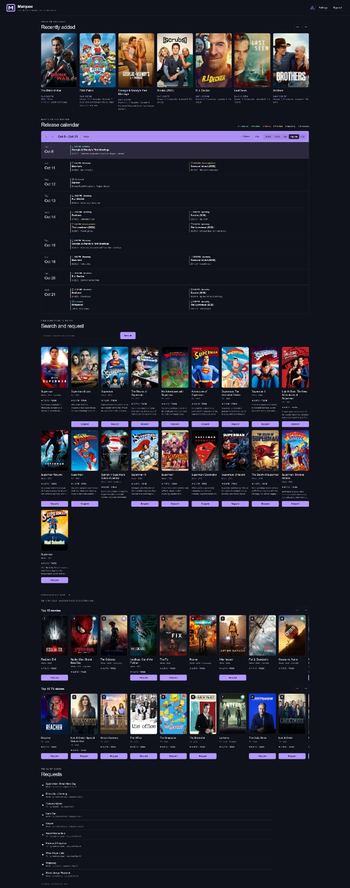
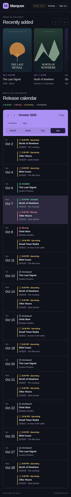

# Marquee

 

A small self-hosted media home screen: recently added at the top, a release calendar underneath. Sign in with your Jellyfin account. Your recent titles follow your Jellyfin library permissions.



<details>
<summary>Mobile demo</summary>
<p align="center"></p>
</details>

## Beta

This is a local beta. No application image or public release has been published yet. The compose setup below runs the source using the official Node image, without a Dockerfile. Live-server compatibility and container deployment still need testing before a release.

During beta, updates are manual. Pull the latest image yourself when updating an image-based installation; Marquee does not auto-update running containers. The CasaOS source-based stack below downloads current source only when you manually restart/recreate it. No version bump is required for each beta change.

## Contents

- [Features](#features)
- [Run with Docker Compose](#run-with-docker-compose)
- [Connection settings](#connection-settings)
- [Privacy and permissions](#privacy-and-permissions)
- [Development and tests](#development-and-tests)

## Features

- Seerr access matches the signed-in Jellyfin ID to an imported Seerr user. Movie/TV permissions and quotas come from Seerr. No allowlist. Requests use the server API key with the verified user ID override; TV requests include all requestable seasons. Ask a Seerr admin to import your Jellyfin user if no match exists. Names and email addresses are never used for matching.

- Jellyfin username and password login gates all media APIs.
- Horizontal poster shelf with added date/time, title, and TV season episode counts.
- Sonarr TV episodes and Radarr movie releases in month, week, day, agenda (next 14 days), or list views. Agenda is the default on desktop and mobile. The app remembers the last view used on each device.
- Colorblind-friendly status colors are off by default and saved per Jellyfin account on the server. Status words remain visible in every theme, with different calendar border patterns in colorblind mode. The optional theme uses blue, yellow, orange, white and gray instead of red/green status colors.
- Requests open the shared detail popup using the exact TMDB movie/TV ID, without a Play button. A hideable Jellyfin header shortcut opens the configured public Jellyfin base in a new tab.
- Popups show up to four cast names from Jellyfin actors or Seerr/TMDB credits when available. No crew list or guessed names.
- Content-rating badges (PG-13, R, TV-MA and others) appear in popups when supplied by Jellyfin or Sonarr/Radarr metadata. Seerr/TMDB popup certifications use US movie/TV ratings; missing certifications stay hidden.
- Poster cards show a star and score without a source label or logo. Jellyfin scores in popups also omit the source label; verified TMDB/IMDb metadata retains its source label. Missing or unrated scores stay hidden. Ratings can be turned off in Settings.
- Recently-added posters open a detail popup with a Play in Jellyfin button that opens the exact movie/episode the card represents. Desktop posters are modestly smaller; mobile sizing is unchanged.
- Click a TV calendar entry for episode details: a complete poster beside the title with dimmed, softened backdrop artwork when supplied, a softened poster fallback, or a solid background if no artwork is available, show/year, episode title, network, runtime, genres and overview. The trailer button opens a clearly labeled YouTube search, not an unverified video. Upcoming season premieres are yellow, regular upcoming episodes white, available green, missing red; cinemas remain blue.
- Monday-first calendar, today highlight, previous/next period, refresh, and type/status filters. An optional hide-unmonitored filter drops unmonitored Sonarr/Radarr entries. Movies can appear twice: cinema and digital/physical releases are separate entries.
- Green: available file. Red: release has passed but the file is missing. Yellow: season premiere. White: upcoming TV. Gray: unreleased movie.
- Optional current weather and three-day forecast, off by default. Choose a city and Fahrenheit/Celsius in Settings, saved server-side per Jellyfin account. Refreshes every 15 minutes while visible, catches up when a stale tab becomes visible, and joins the Refresh button. Open-Meteo weather and city search are free for non-commercial use, with no API key or account.
- Jellyfin administrators can change the shared display name in Settings. It defaults to Marquee and survives container restarts.
- Top 10 popular movies and TV shows come from Seerr, with request/availability indicators based on its latest library scan. Talk shows are excluded from the TV ranking and later popular results backfill the list. Both poster rows can be collapsed with the inline chevron or hidden entirely in Settings. Desktop hover and keyboard focus highlight posters. Click a search-result or top-10 poster for its details, network/studio, overview and trailer search; the request action stays on its card.
- A quiet "Requests" section lists recent requests from everyone with requester display names, never emails. Reads retain the linked Seerr user: Seerr users need View Requests or Manage Requests permission to see other users' requests; otherwise Seerr returns only their own. No badges, no counts.
- Poster and title taps deep-link into Jellyfin's web player through the external URL setting.
- Settings includes per-service connection tests with real error messages (DNS failure, connection refused, timeout, or HTTP status).
- Installable as a PWA (manifest and service worker). Only static assets are cached; media API responses are never cached.
- Settings can hide either main section, weather, the status legend, added dates, and poster navigation arrows.
- Mobile defaults to Agenda. Month/week remain available with horizontal scrolling instead of squeezed columns.
- Display preferences are stored on the current device. Weather enabled state, city and F/C units are saved server-side per Jellyfin account and follow that user across devices. The display name is shared.
- Demo mode with fictional titles and original sample poster art. No external credentials required.

## Run with Docker Compose

Requires Docker Engine with the Compose plugin. Put this source folder on your server. You do not need to build a Dockerfile.

1. Copy `.env.example` to `.env` beside `compose.yaml`.
2. Fill in your service URLs and keys. Keep `.env` private and out of git.
3. Set your timezone. Keep `DEMO_MODE=false` for real use.
4. Start:

```sh
docker compose up -d
```

Open the configured port through an HTTPS reverse proxy. `COOKIE_SECURE=true` requires HTTPS. For a local HTTP demo only, set `DEMO_MODE=true` and `COOKIE_SECURE=false`.

The initial beta copies the mounted source into a temporary writable container directory and installs the locked production dependencies at startup. This needs internet access to the package registry. Sessions live in memory, so a restart signs users out. The `marquee-settings` volume keeps the administrator-set display name and per-user weather/colorblind preferences across container restarts. Other display preferences remain on the current device. Do not delete the settings volume when upgrading.

### CasaOS or standalone stack (no clone needed)

This is the easiest option for CasaOS, Dockhand, or another stack manager. You do not need to download the source folder. Settings come from a `.env` file beside your compose file, or your stack manager's Environment settings.

1. Copy the complete example below into your stack editor (or use `compose.casaos.yaml`).
2. Add the variables from the `.env` example below to a `.env` file beside your compose file, or to the stack's Environment settings. Fill in your own service URLs and API keys. Keep your keys private.
3. Set your timezone. Leave `DEMO_MODE` off for your real media.
4. Keep `COOKIE_SECURE` true for HTTPS. Use false only on a trusted plain-HTTP home network.
5. Set `MARQUEE_PORT` to your host port (usually `8739`). Keep `target: 8739` in the compose.
6. Start the stack. Open your server at that port, or use your HTTPS reverse proxy.

You only need to edit the settings above. The commented startup steps download Marquee, install its runtime packages, and start it automatically. Your server needs internet access to GitHub and npm during startup. If a download fails, startup stops rather than running an incomplete app.

**Updates:** restart or recreate the stack to download the latest beta. A running app does not update itself. Restarting signs users out.

**Saved settings:** they stay in `/DATA/AppData/marquee/settings`. Keep that folder when updating. The small `marquee-init` helper prepares it for the app. Seeing this helper show `Exited (0)` is normal; the main `marquee` service should stay running. If you change the settings path, change it in both services.

Docker Compose waits for the helper to finish before starting Marquee. CasaOS uses Compose v2; older installations may behave differently.

```yaml
name: marquee
services:
  # Creates non-root ownership for settings. Exited (0) is normal.
  marquee-init:
    image: alpine:3.21
    user: 0:0
    command:
      - sh
      - -c
      - chown -R 1000:1000 /settings
    volumes:
      - type: bind
        source: /DATA/AppData/marquee/settings
        target: /settings
    read_only: true
    cap_drop:
      - ALL
    cap_add:
      - CHOWN
      - DAC_OVERRIDE
    security_opt:
      - no-new-privileges:true
    restart: "no"
  marquee:
    image: node:22-alpine
    working_dir: /app
    user: node
    init: true
    depends_on:
      marquee-init:
        condition: service_completed_successfully
    # Downloads current main on restart; requires HTTPS access to GitHub and npm.
    command:
      - sh
      - -c
      - |
          set -eu

          # 1. Download Marquee from GitHub.
          wget -O /app/source.tar.gz \
            https://codeload.github.com/dhrandy/marquee/tar.gz/refs/heads/main

          # 2. Unpack the app and remove the download.
          tar -xzf /app/source.tar.gz -C /app --strip-components=1
          rm /app/source.tar.gz

          # 3. Leave tests and development files out of the running copy.
          rm -rf /app/tests /app/docs /app/.github \
            /app/playwright.config.js /app/README.md \
            /app/compose.yaml /app/compose.casaos.yaml \
            /app/.env.example /app/.gitignore

          # 4. Install only the packages the app needs to run.
          npm ci --omit=dev --ignore-scripts --no-audit --no-fund

          # 5. Start Marquee.
          exec node src/server.js
    # Change published for your host port; keep target 8739.
    ports:
      - target: 8739
        published: "${MARQUEE_PORT}"
        protocol: tcp
    # Values come from your .env file or stack Environment settings.
    environment:
      TZ: ${TZ}
      DEMO_MODE: ${DEMO_MODE}
      # false only for a trusted plain-HTTP LAN; keep true behind HTTPS.
      COOKIE_SECURE: ${COOKIE_SECURE}
      TRUSTED_PROXIES: ${TRUSTED_PROXIES:-}
      TRUST_PROXY: ${TRUST_PROXY:-0}
      JELLYFIN_URL: ${JELLYFIN_URL}
      SONARR_URL: ${SONARR_URL}
      SONARR_API_KEY: ${SONARR_API_KEY}
      RADARR_URL: ${RADARR_URL}
      RADARR_API_KEY: ${RADARR_API_KEY}
      SEERR_URL: ${SEERR_URL}
      SEERR_API_KEY: ${SEERR_API_KEY}
      # Browser-facing Jellyfin URL; blank falls back to JELLYFIN_URL.
      JELLYFIN_WEB_URL: ${JELLYFIN_WEB_URL}
    volumes:
      - type: bind
        # Persistent settings: keep this source in sync with marquee-init.
        source: /DATA/AppData/marquee/settings
        target: /home/node
    tmpfs:
      - /app:uid=1000,gid=1000,mode=0700
      - /home/node/.npm:uid=1000,gid=1000,mode=0700
    read_only: true
    cap_drop:
      - ALL
    security_opt:
      - no-new-privileges:true
    restart: unless-stopped
    healthcheck:
      test:
        - CMD
        - node
        - -e
        - fetch('http://127.0.0.1:8739/api/config').then(r=>process.exit(r.ok?0:1)).catch(()=>process.exit(1))
      interval: 30s
      timeout: 5s
      start_period: 60s
```

The original `compose.yaml` below is for an existing local/git checkout. Do not use its source mount with an empty CasaOS folder.

### Local-checkout compose (requires source folder)

```yaml
services:
  marquee:
    image: node:22-alpine
    working_dir: /app
    user: node
    init: true
    command:
      - sh
      - -c
      - |
          set -e

          # Copy the app from your downloaded source folder.
          cp /source/package*.json /app/
          cp -R /source/src /source/public /app/

          # Install only the packages the app needs to run.
          npm ci --omit=dev --ignore-scripts --no-audit --no-fund

          # Start Marquee.
          node src/server.js
    ports:
      - "${MARQUEE_PORT}:8739"
    environment:
      TZ: ${TZ}
      DEMO_MODE: ${DEMO_MODE}
      COOKIE_SECURE: ${COOKIE_SECURE}
      TRUSTED_PROXIES: ${TRUSTED_PROXIES:-}
      TRUST_PROXY: ${TRUST_PROXY:-0}
      JELLYFIN_URL: ${JELLYFIN_URL}
      SONARR_URL: ${SONARR_URL}
      SONARR_API_KEY: ${SONARR_API_KEY}
      RADARR_URL: ${RADARR_URL}
      RADARR_API_KEY: ${RADARR_API_KEY}
      SEERR_URL: ${SEERR_URL}
      SEERR_API_KEY: ${SEERR_API_KEY}
      JELLYFIN_WEB_URL: ${JELLYFIN_WEB_URL}
    volumes:
      - ./:/source:ro
      - marquee-settings:/home/node
    tmpfs:
      - /app:uid=1000,gid=1000,mode=0700
      - /home/node/.npm:uid=1000,gid=1000,mode=0700
    read_only: true
    cap_drop:
      - ALL
    security_opt:
      - no-new-privileges:true
    restart: unless-stopped
    healthcheck:
      test:
        [
          "CMD",
          "node",
          "-e",
          "fetch('http://127.0.0.1:8739/api/config').then(r=>process.exit(r.ok?0:1)).catch(()=>process.exit(1))",
        ]
      interval: 30s
      timeout: 5s
      start_period: 60s

volumes:
  marquee-settings:
```

### Filled `.env` example

These are example values, not working credentials.

```dotenv
# Marquee settings. Copy to .env and fill in your own values. Keep .env private.

# Port on the host that Marquee listens on (container port stays 8739).
MARQUEE_PORT=8739
# Your timezone, for example America/New_York. List: en.wikipedia.org/wiki/List_of_tz_database_time_zones
TZ=Etc/UTC
# Demo mode shows fake titles with no login. For trying the app only - never for a real deployment.
DEMO_MODE=false
# true when Marquee sits behind an HTTPS reverse proxy (recommended). false only for a local HTTP demo.
COOKIE_SECURE=true
# Proxy IP/CIDR allowlist as seen by the container. Empty means no forwarded headers trusted.
TRUSTED_PROXIES=
# Simple single-proxy alternative. 1 only when every backend connection comes through your proxy.
TRUST_PROXY=0

# Internal vs external URLs: the container talks to your services over your
# Docker/LAN network (internal). Deep links people tap on their phones use the
# public reverse-proxy address (external). Set both when they differ.

# Jellyfin internal URL: how this container reaches Jellyfin (Docker service name or LAN address).
JELLYFIN_URL=http://jellyfin:8096
# Jellyfin external URL: the address browsers open when you tap a poster. Falls back to JELLYFIN_URL.
JELLYFIN_WEB_URL=https://jellyfin.example.com

# Sonarr: base URL + API key (Settings > General in Sonarr).
SONARR_URL=http://sonarr:8989
SONARR_API_KEY=replace-with-your-sonarr-api-key
# Radarr: base URL + API key (Settings > General in Radarr).
RADARR_URL=http://radarr:7878
RADARR_API_KEY=replace-with-your-radarr-api-key

# Seerr (Jellyseerr or Overseerr): base URL + API key (Settings > General).
SEERR_URL=http://seerr:5055
SEERR_API_KEY=replace-with-your-seerr-api-key

# Optional external URLs for the other services, reserved for future deep links (unused today):
# SONARR_WEB_URL=https://sonarr.example.com
# RADARR_WEB_URL=https://radarr.example.com
# SEERR_WEB_URL=https://seerr.example.com

# Weather is set per viewer in Settings: city picker and F/C units.
# Open-Meteo weather and city search are free for non-commercial use. No API key or account needed.
# Dashboard display name is set by a Jellyfin administrator in Settings (default Marquee).
```

Dockhand users can put these variables in the stack's Environment tab instead of a `.env` file. The source folder must still be mounted: change `./:/source:ro` to your source checkout location if Dockhand's stack directory differs. No particular host OS, NAS, or stack manager is required.

### Reverse proxy

Terminate HTTPS at your preferred reverse proxy and forward to port 8739. Preserve the original Host header for same-origin write checks. Do not cache `/api/` responses. Do not expose the HTTP port directly to the internet. Users should always submit Jellyfin passwords over HTTPS. With `COOKIE_SECURE=true`, all writes require an exact HTTPS Origin; local HTTP origins work only when explicitly false. Set `TRUSTED_PROXIES` to a comma-separated list of the proxy IPs or narrow CIDRs as seen by the container. The default is empty (forwarded headers ignored). Alternatively set `TRUST_PROXY=1` for exactly one proxy hop; no IP lookup is needed. Its default is `0` (off); other hop counts and `true` are rejected. A nonempty `TRUSTED_PROXIES` allowlist takes precedence. Never trust all addresses. Your proxy must overwrite incoming X-Forwarded-For with the real client IP, preserve Host, and be the only path to the backend port. Do not whitelist a shared gateway reachable by untrusted clients. The compose files publish the backend on host interfaces by default; they do not enforce proxy-only access. For one-hop trust, firewall/bind/network rules must prevent ALL direct backend access, including untrusted LAN clients and containers. If a caller can connect directly, they can spoof their client IP and bypass login throttling. Keep trust off or use the strict allowlist until access is restricted. Private deployment addresses belong in your local environment, not the public repo.

## Connection settings

- `JELLYFIN_URL`: server base URL, including a path prefix if configured. No Jellyfin API key. Each user enters their own username/password on the sign-in screen.
- `SONARR_URL` and `SONARR_API_KEY`: server base URL and API key. Requests use `/api/v3/calendar` with `includeSeries=true`.
- `RADARR_URL` and `RADARR_API_KEY`: server base URL and API key. Requests use `/api/v3/calendar`.
- `SEERR_URL` and `SEERR_API_KEY`: Jellyseerr or Overseerr base URL and API key. Search uses `/api/v1/search`; requests use `/api/v1/request`.
- Internal/external URL split: `JELLYFIN_URL`, `SONARR_URL`, `RADARR_URL`, and `SEERR_URL` are how the container reaches each service (Docker network or LAN). `JELLYFIN_WEB_URL` is the public address browsers open when someone taps a poster; it defaults to `JELLYFIN_URL`. Set both when containers use an internal address phones cannot open. `SONARR_WEB_URL`, `RADARR_WEB_URL`, and `SEERR_WEB_URL` are reserved for future deep links and unused today.
- Weather: use Settings to find and pick a city, choose F/C units, and enable the widget. These choices are saved on the server for that viewer, not in `.env`.
- Display name: Jellyfin administrators see a name field in Settings. The default is Marquee; the shared value is stored in the settings volume. This changes the dashboard header and browser tab. Installed PWA icons/name remain Marquee.
- `TZ`: server timezone. Calendar air times and poster dates use the viewer's browser timezone.

The app server must be able to reach all configured services. Browser CORS settings are not needed because requests go through the server. Service URLs may include a configured URL-base path; trailing slashes are optional. A missing scheme defaults to HTTP. HTTPS certificates must be trusted, and API redirects are not followed. Connection tests and calendar warnings distinguish HTTP errors, redirects, timeouts and invalid API responses.

Movie dates prefer digital release, then physical release, then cinema release. Cinema and digital/home releases appear separately. Cinema entries have their own blue status and are not marked missing. A file always makes an entry Available. TV season counts include the episodes visible to that Jellyfin user in that season, not only the newly added batch. Virtual/missing/placeholder Jellyfin records are excluded so shelf links target the actual local or remote media item, not future metadata-only episodes. The shelf shows up to 18 recently added movie/TV-season cards, fetching more episodes as needed so a large season import does not crowd out other titles. Different seasons of a show may appear separately. Season-zero specials and podcasts are excluded from the shelf so they do not replace regular season cards. Each TV card identifies the latest-added regular episode number and title; missing season metadata is resolved from Jellyfin rather than assumed to be season zero.

## Privacy and permissions

The recent Jellyfin shelf and Seerr request list are per-user. **The Sonarr/Radarr calendar is shared among all signed-in viewers.** Seerr search runs as the linked user and the request list shows only that user's requests. They may include titles a viewer cannot access in Jellyfin. Do not deploy for untrusted users without a calendar permission layer. Seerr requesting follows the linked user's own movie/TV permissions and quotas; the Seerr API key never reaches the browser. Request-list titles are resolved through Seerr's movie/TV metadata API using the linked user. If metadata is temporarily unavailable, the request status remains visible with its TMDB id.

Passwords are sent to Jellyfin and are not stored or logged. Jellyfin access tokens and opaque sessions stay in server memory. Cookies are HttpOnly, SameSite Strict, secure by default, and expire after eight hours. Sign-out removes the local session. It does not revoke the Jellyfin access token upstream; server restarts drop stored tokens.

Media APIs and image proxies require a session. Images are limited to item IDs returned for that viewer. API keys never go to the browser. Service URLs are administrator configuration, not user-editable request destinations. Login is rate-limited per client IP. Forwarded client IPs are used through the strict `TRUSTED_PROXIES` allowlist or opt-in `TRUST_PROXY=1` for isolated single-proxy deployments. Both default off; otherwise only the direct socket IP is trusted. Authenticated API traffic is capped at 240 calls per user per minute (weather/city search at 30). Image downloads are bounded while streaming; remote calendar art permits only fixed HTTPS TVDB/TMDB hosts without credentials, ports or redirects. The app rejects cross-origin writes, escapes media titles, sends security headers, and blocks indexing with a robots rule and headers. These do not replace authentication.

Demo mode must not be enabled for private live deployments: it allows anyone to open the sample dashboard without Jellyfin credentials. Demo adapters are separate from the live adapters and cannot expose live data.

City searches share the typed city name with Open-Meteo when you press Find city. Forecast requests share the selected city coordinates only when the widget is enabled. Results are cached for 15 minutes. Attribution stays visible with the widget. Weather and geocoding need no key or account and are free for non-commercial use. See [geocoding documentation](https://open-meteo.com/en/docs/geocoding-api) and [Open-Meteo documentation](https://open-meteo.com/en/docs) for service terms and use limits.

## Development and tests

Node 22 or newer:

```sh
npm ci
DEMO_MODE=true COOKIE_SECURE=false npm start
```

For tests, install Chromium with Playwright or set `CHROME_PATH` to a local Chrome executable:

```sh
npx playwright install chromium
npm test
```

Tests live in `tests/`. They cover calendar status mapping, date ranges, API auth gates, same-origin protection, no-crawl/security headers, calendar navigation and filters, settings persistence, weather toggling, logout, and mobile overflow at 393, 320, and 280 pixels. Browser screenshot output goes to `/downloads` locally or the test output directory in CI. The workflow runs tests only. It does not publish anything.

Integration adapters live separately from the UI so another feed can be added later.

## Third-party artwork

The Jellyfin shortcut uses the unmodified [official Jellyfin icon](https://raw.githubusercontent.com/jellyfin/jellyfin-ux/master/logos/SVG/jellyfin-icon--color-on-dark.svg) by the Jellyfin contributors, licensed under [CC BY-SA 4.0](public/licenses/jellyfin-CC-BY-SA-4.0.txt). It identifies the Jellyfin link, not Marquee. Marquee is an independent project.

## Rights

Copyright (c) 2026 dhrandy. All rights reserved. Marquee is proprietary; no open-source license is granted. Third-party asset notices apply only to those assets.
